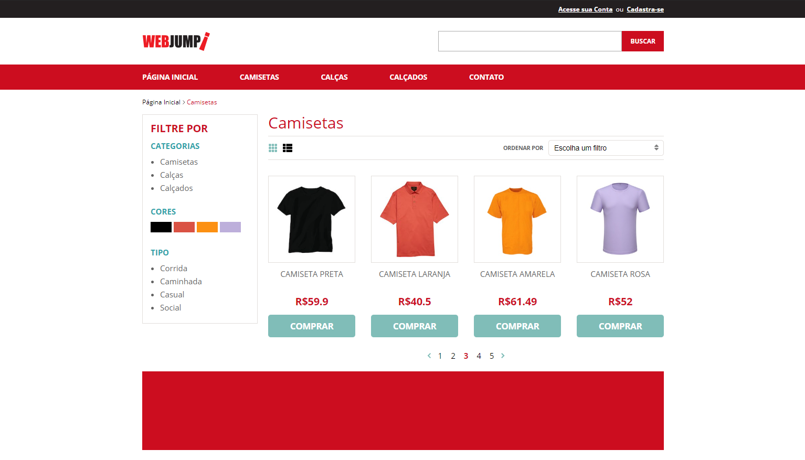

<h1>
    WebJump Front-end
</h1>

<p>Desafio Técnico</p>

<p>
  
  
  
  
  
</p>

<p>
  <a href="#-features">Features</a>&nbsp;&nbsp;&nbsp;|&nbsp;&nbsp;&nbsp;
  <a href="#-pré-requisitos">Pré-Requisitos</a>&nbsp;&nbsp;&nbsp;|&nbsp;&nbsp;&nbsp;
  <a href="#-tecnologias">Tecnologias</a>&nbsp;&nbsp;&nbsp;|&nbsp;&nbsp;&nbsp;
  <a href="#-licença">Lincença</a>
</p>

<h3> 
🚧  Finalizado  🚧
</h3>

### 📎 Features 

- Página dos Produtos
- Filtros únicos, disponíveis conforme a categoria
- Ordenação dos produtos
- Opções de visualização(grid/list) 
- Busca por produtos, conforme a categoria

### 💻 Projeto

O projeto, basicamente, se resume em uma palavra: Ecommerce, isto é, uma loja virtual para realizações de compras.

### ✅ Demonstração


### ⚙ Pré-requisitos

Antes de começar, você vai precisar ter instalado em sua máquina as seguintes ferramentas:
[Git](https://git-scm.com), [Node.js](https://nodejs.org/en/) e/ou [Yarn](https://yarnpkg.com/). 
Além disto é bom ter um editor para trabalhar com o código como [VSCode](https://code.visualstudio.com/)

### 📗 Rodando a Aplicação (web)

```bash
# Clone este repositório
$ git clone https://gustavo-nt@bitbucket.org/gustavo-nt/challenge_webjump.git

# Instale as dependências
$ yarn

# Execute a aplicação
$ yarn dev

# Executar a aplicação de produção
$ yarn start

# Rode o servidor fake
$ yarn server
```

### 🚀 Tecnologias

Esse projeto foi desenvolvido com as seguintes tecnologias:

- React
- Next
- Node
- Javascript

### 📕 Bibliotecas

Esse projeto foi utilizou das seguintes lib e/ou pré-processadores:

- react-dom
- react-icons
- cors
- connect
- axios
- sass
- next images
- serve-static
- babel-plugin-inline-react-svg

### ⚖ Direitos

Todos direitos de imagem são reservados a WebJump.

### 📝 Licença

Esse projeto está sob a licença MIT.

<hr/>

Feito por Gustavo Teixeira